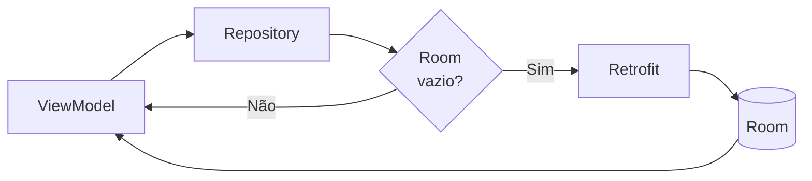

# Repository Pattern com Room + Retrofit (JSONPlaceholder)

## O que é o Repository Pattern e por que usá-lo?

O **Repository Pattern** é um padrão de projeto (uma forma testada e conhecida de organizar código) que cria uma camada de abstração entre as fontes de dados (banco de dados local, API remota, cache) e o restante da aplicação (ViewModel, Use Cases).

Pense no Repository como um "estoquista" de um restaurante. O chef (o ViewModel) não quer saber se o tomate veio da horta do fundo (banco local) ou foi comprado no mercado hoje de manhã (rede) — ele só pede "me dê tomates" ao estoquista, que decide de onde tirar o ingrediente mais fresco disponível.

Sem um Repository, o ViewModel precisaria saber de onde os dados vêm — se da rede ou do banco local — e gerenciar toda essa complexidade diretamente, misturando lógica de UI com lógica de acesso a dados. Com o Repository, o ViewModel simplesmente pede "me dê os posts" e o Repository decide a melhor estratégia: verificar o cache primeiro, ir à rede se necessário, combinar as fontes, etc.

## Por que isso importa?

Sem essa camada de abstração, cada mudança na forma de buscar dados (por exemplo, trocar de Retrofit para outra biblioteca, ou adicionar um cache) obrigaria você a alterar código dentro do ViewModel — misturando responsabilidades e tornando o app mais frágil e difícil de testar. Os principais ganhos do Repository Pattern são:

- **Separação de responsabilidades**: o ViewModel não sabe de onde os dados vêm; ele só conhece a interface do Repository.
- **Testabilidade**: em testes automatizados, é fácil substituir o Repository real por uma versão "fake" que devolve dados fixos, sem precisar de rede nem banco de verdade.
- **Reutilização**: múltiplos ViewModels (por exemplo, a tela de lista e a tela de detalhe) podem usar o mesmo Repository.
- **Estratégias de cache**: centraliza a lógica de "quando buscar localmente vs. remotamente" em um único lugar, em vez de espalhar essa decisão pela UI.

O fluxo de dados neste exemplo segue a estratégia **cache-first** (cache primeiro): o Repository sempre olha o banco local primeiro; só vai à rede se o banco estiver vazio.



---

Exemplo mínimo, focado em aprendizagem e clareza. A lógica: tentar ler do banco; se vazio, buscar remoto, salvar e devolver. Camadas: Entity (Room), DAO, Database, API (Retrofit), Repository, ViewModel, UI (Compose). Se algum desses termos ainda não é familiar, os Módulos 3.01 (Coroutines), 3.02 (Retrofit) e 3.03 (Room) explicam cada peça em detalhe — aqui vamos focar em como elas se conectam.

## Dependências (build.gradle app)

```kotlin
plugins {
    id("com.android.application")
    id("org.jetbrains.kotlin.android")
    id("com.google.devtools.ksp") // KSP: substitui o KAPT para Room (mais rápido)
}

dependencies {
    // Room (use ksp em vez de kapt: mais rápido e sem warnings)
    implementation("androidx.room:room-runtime:2.7.0")
    implementation("androidx.room:room-ktx:2.7.0")
    ksp("androidx.room:room-compiler:2.7.0")

    // Coroutines
    implementation("org.jetbrains.kotlinx:kotlinx-coroutines-android:1.9.0")

    // Retrofit + Gson
    implementation("com.squareup.retrofit2:retrofit:2.11.0")
    implementation("com.squareup.retrofit2:converter-gson:2.11.0")

    // Lifecycle
    implementation("androidx.lifecycle:lifecycle-viewmodel-ktx:2.8.7")
    implementation("androidx.lifecycle:lifecycle-runtime-ktx:2.8.7")

    // Compose (BOM gerencia versões automaticamente)
    implementation(platform("androidx.compose:compose-bom:2025.01.00"))
    implementation("androidx.compose.ui:ui")
    implementation("androidx.compose.material3:material3")
    implementation("androidx.activity:activity-compose:1.10.1")
    implementation("androidx.compose.ui:ui-tooling-preview")

}
```

## Entity + DAO (Room)

A `PostEntity` representa a tabela local; o `PostDao` declara como ler e escrever nela. Aqui as leituras são funções `suspend` (busca única), diferente do Módulo 3.03, onde vimos leituras via `Flow` (observação contínua) — as duas abordagens são válidas, a escolha depende de a tela precisar ou não reagir automaticamente a mudanças no banco. Como o Módulo 3.03 já explicou `@Entity` e `@Dao` em detalhe, aqui vamos direto ao ponto:

```kotlin
import androidx.room.*

// @Entity: cada instância desta classe é uma linha da tabela "posts".
@Entity(tableName = "posts")
data class PostEntity(
    @PrimaryKey val id: Int, // Usamos o próprio id do post remoto como chave primária.
    val userId: Int,
    val title: String,
    val body: String
)

// @Dao: interface de acesso ao banco. O Room gera a implementação automaticamente.
@Dao
interface PostDao {
    // suspend fun (em vez de Flow): busca única, não fica "escutando" mudanças.
    @Query("SELECT * FROM posts")
    suspend fun getAll(): List<PostEntity>

    // OnConflictStrategy.REPLACE: se já existir uma linha com o mesmo id,
    // ela é sobrescrita — assim podemos inserir a mesma lista várias vezes sem erro.
    @Insert(onConflict = OnConflictStrategy.REPLACE)
    suspend fun insertAll(posts: List<PostEntity>)
}
```

## Database (Room)

Igual ao que já vimos no Módulo 3.03: um `@Database` singleton que dá acesso ao `PostDao`.

```kotlin
// @Database: ponto de entrada do Room, lista as entidades e a versão do schema.
@Database(entities = [PostEntity::class], version = 1)
abstract class AppDatabase : RoomDatabase() {
    abstract fun postDao(): PostDao

    companion object {
        // Padrão singleton: garante uma única instância do banco em todo o app
        // (veja a explicação completa no Módulo 3.03).
        @Volatile private var INSTANCE: AppDatabase? = null

        fun get(context: android.content.Context): AppDatabase =
            INSTANCE ?: synchronized(this) {
                INSTANCE ?: Room.databaseBuilder(
                    context.applicationContext,
                    AppDatabase::class.java,
                    "app.db"
                ).build().also { INSTANCE = it }
            }
    }
}
```

## API Retrofit

O `JsonPlaceholderApi` descreve o endpoint remoto (veja o Módulo 3.02 para o detalhamento completo de Retrofit). O `PostDto` espelha o JSON retornado pela API.

```kotlin
import retrofit2.http.GET

// DTO: mesma estrutura do JSON retornado pela API.
data class PostDto(
    val userId: Int,
    val id: Int,
    val title: String,
    val body: String
)

interface JsonPlaceholderApi {
    @GET("posts")
    suspend fun getPosts(): List<PostDto>
}

object ApiFactory {
    fun create(): JsonPlaceholderApi {
        val gson = com.google.gson.GsonBuilder().create()
        val retrofit = retrofit2.Retrofit.Builder()
            .baseUrl("https://jsonplaceholder.typicode.com/") // barra final obrigatória
            .addConverterFactory(
                retrofit2.converter.gson.GsonConverterFactory
                    .create(gson)
            )
            .build()
        return retrofit.create(JsonPlaceholderApi::class.java)
    }
}
```

## Model (opcional para camada de domínio)

O modelo `Post` é o que o ViewModel e a UI enxergam — desacoplado de como o dado chegou (rede ou banco). As duas funções de extensão abaixo fazem a "tradução" entre cada fonte e esse modelo comum.

```kotlin
data class Post(
    val id: Int,
    val userId: Int,
    val title: String,
    val body: String
)

// Converte a linha do banco (Entity) para o modelo de domínio.
fun PostEntity.toModel() = Post(id, userId, title, body)
// Converte a resposta da API (DTO) para a linha do banco (Entity).
fun PostDto.toEntity() = PostEntity(id, userId, title, body)
```

## Repository

Este é o coração do padrão: a lógica de decidir "de onde vêm os dados" fica isolada aqui, longe do ViewModel e da UI.

```kotlin
class PostRepository(
    private val dao: PostDao,
    private val api: JsonPlaceholderApi
) {
    // Obtém posts: se o banco local já tem dados, devolve eles direto (rápido,
    // funciona offline). Se estiver vazio, busca na rede e preenche o banco.
    suspend fun getPosts(): List<Post> {
        val local = dao.getAll()
        if (local.isNotEmpty()) {
            return local.map { it.toModel() } // Cache hit: nem toca na rede.
        }
        // Cache miss: busca remoto, converte para Entity e salva no banco.
        val remote = api.getPosts()
        val entities = remote.map { it.toEntity() }
        dao.insertAll(entities)
        return entities.map { it.toModel() }
    }

    // Força atualização remota, ignorando o que já está no cache local.
    // Útil para um botão "puxar para atualizar" (pull-to-refresh) ou "Atualizar".
    suspend fun refresh(): List<Post> {
        val remote = api.getPosts()
        val entities = remote.map { it.toEntity() }
        dao.insertAll(entities)
        return entities.map { it.toModel() }
    }
}
```

## ViewModel

```kotlin
import androidx.lifecycle.ViewModel
import androidx.lifecycle.viewModelScope
import kotlinx.coroutines.flow.*
import kotlinx.coroutines.launch

class PostViewModel(
    private val repository: PostRepository
) : ViewModel() {

    // Estado privado e mutável, exposto publicamente como somente-leitura.
    private val _uiState = MutableStateFlow(UiState())
    val uiState: StateFlow<UiState> = _uiState.asStateFlow()

    // data class agrupa tudo que a tela precisa saber sobre seu próprio estado.
    data class UiState(
        val loading: Boolean = false,
        val posts: List<Post> = emptyList(),
        val error: String? = null
    )

    init {
        loadInitial() // Busca os dados assim que o ViewModel é criado.
    }

    private fun loadInitial() {
        viewModelScope.launch {
            // .update { } modifica o estado atual de forma segura (imutável).
            _uiState.update { it.copy(loading = true, error = null) }
            try {
                val data = repository.getPosts()
                _uiState.update { it.copy(loading = false, posts = data) }
            } catch (e: Exception) {
                _uiState.update { it.copy(loading = false, error = e.message) }
            }
        }
    }

    fun refresh() {
        viewModelScope.launch {
            _uiState.update { it.copy(loading = true, error = null) }
            try {
                val data = repository.refresh()
                _uiState.update { it.copy(loading = false, posts = data) }
            } catch (e: Exception) {
                _uiState.update { it.copy(loading = false, error = e.message) }
            }
        }
    }
}
```

## Factory

```kotlin
// Sem Hilt (Módulo 3.07), montamos manualmente toda a cadeia de dependências
// aqui: banco -> DAO, API, e finalmente o Repository e o ViewModel.
class PostViewModelFactory(
    private val context: android.content.Context
) : androidx.lifecycle.ViewModelProvider.Factory {
    override fun <T : androidx.lifecycle.ViewModel> create(modelClass: Class<T>): T {
        val db = AppDatabase.get(context)
        val api = ApiFactory.create()
        val repo = PostRepository(db.postDao(), api)
        return PostViewModel(repo) as T
    }
}
```

## UI (Jetpack Compose)

```kotlin
import androidx.compose.runtime.*
import androidx.compose.material3.*
import androidx.compose.foundation.layout.*
import androidx.compose.foundation.lazy.LazyColumn
import androidx.compose.foundation.lazy.items
import androidx.lifecycle.viewmodel.compose.viewModel

@Composable
fun PostScreen(
    // viewModel(factory = ...) cria (ou reaproveita) o ViewModel usando a Factory.
    vm: PostViewModel = viewModel(factory = PostViewModelFactory(LocalContext.current))
) {
    val state by vm.uiState.collectAsState()

    Scaffold(
        topBar = {
            TopAppBar(
                title = { Text("Posts") },
                actions = {
                    IconButton(onClick = { vm.refresh() }) {
                        Icon(Icons.Default.Refresh, contentDescription = "Atualizar")
                    }
                }
            )
        }
    ) { padding ->
        Box(Modifier.padding(padding).fillMaxSize()) {
            when {
                state.loading -> CircularProgressIndicator(Modifier.align(Alignment.Center))
                state.error != null -> Text(
                    "Erro: ${state.error}",
                    Modifier.align(Alignment.Center),
                    color = MaterialTheme.colorScheme.error
                )
                else -> PostList(state.posts)
            }
        }
    }
}

@Composable
fun PostList(posts: List<Post>) {
    LazyColumn {
        items(posts) { post ->
            Card(
                Modifier
                    .padding(8.dp)
                    .fillMaxWidth()
            ) {
                Column(Modifier.padding(12.dp)) {
                    Text(post.title, style = MaterialTheme.typography.titleMedium)
                    Spacer(Modifier.height(4.dp))
                    Text(post.body, style = MaterialTheme.typography.bodyMedium)
                }
            }
        }
    }
}
```

## Activity

```kotlin
class MainActivity : ComponentActivity() {
    override fun onCreate(savedInstanceState: android.os.Bundle?) {
        super.onCreate(savedInstanceState)
        setContent {
            MaterialTheme {
                PostScreen()
            }
        }
    }
}
```

## Erros Comuns / Pegadinhas

1. **Cache-first sem nenhuma forma de "expirar" o cache.** Neste exemplo, uma vez que o banco tem dados, `getPosts()` nunca mais busca da rede automaticamente — só o botão "Atualizar" (`refresh()`) força isso. Em um app real, você provavelmente vai querer uma regra de expiração (ex.: "recarregar se o cache tiver mais de 1 hora"), senão o usuário pode ficar vendo dados desatualizados por muito tempo sem perceber.

2. **Repository engolindo erros silenciosamente.** Se tanto a leitura do banco quanto a chamada de rede falharem, é importante que esse erro chegue até o ViewModel (como acontece aqui, via `try/catch`) para que a UI possa mostrar algo ao usuário — nunca deixe uma falha desaparecer sem nenhum feedback.

3. **Passar `Context` diretamente para a `Factory` do ViewModel.** Isso funciona neste exemplo simples, mas guardar uma referência a `Context` (especialmente uma Activity) por tempo demais pode causar vazamento de memória. Sempre use `context.applicationContext` quando precisar guardar a referência por mais tempo (como já fazemos dentro do `AppDatabase.get()`), ou prefira injeção de dependência com Hilt (Módulo 3.07), que resolve isso de forma mais segura.

4. **Achar que `PostRepository` recebendo `PostDao` e `JsonPlaceholderApi` no construtor é "injeção de dependência" completa.** Isso é só o primeiro passo — receber dependências prontas em vez de criá-las internamente. O próximo nível é ter um framework (como o Hilt) automatizando essa criação e entrega, o que veremos no Módulo 3.07.

---

## Resumo

| Conceito | Papel no Repository Pattern |
|---|---|
| `Entity` / `DAO` (Room) | Fonte de dados local (cache) |
| `DTO` / API (Retrofit) | Fonte de dados remota |
| Modelo de domínio | Formato único que ViewModel e UI enxergam |
| `Repository` | Decide de onde vêm os dados e unifica as fontes |
| Estratégia *cache-first* | Lê do banco primeiro; só vai à rede se necessário |
| `refresh()` | Força atualização remota, ignorando o cache |

## Observações

- Erros tratados de forma simples (`Exception` genérica) — em um app real, vale diferenciar tipos de erro (veja Módulo 3.02).
- Para produção, use DI (Hilt, Módulo 3.07) e uma melhor estratégia de expiração de cache/atualização.
- Atualização manual via botão e automática apenas quando o cache está vazio.
- Este exemplo não cobre paginação nem testes automatizados — são bons próximos desafios depois de dominar o padrão básico.

**Próximo passo:** no arquivo `05_flow_avancado.md` vamos explorar operadores mais avançados de `Flow` (como `combine`, `debounce` e `flatMapLatest`) para lidar com cenários mais ricos, como busca com filtro em tempo real.
